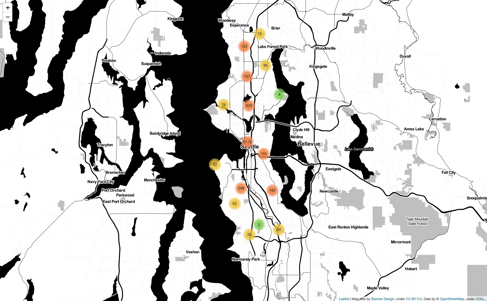

# Seattle Food Inspection Project

A visualization tool to view food inspection ratings in Seattle, WA and the median income of the surrounding area.

## Prerequisites
Before continuing, you should have a version of Python 3 installed along with meeting the requirements found in `requirements.txt`.

## Project Goal

The broad goal of this project is to create a visual representation of the link between food inspection scores in Seattle, Washington and various demographic information of the surrounding area. At least in north west Ethiopia (see [this paper](https://www.ncbi.nlm.nih.gov/pmc/articles/PMC4057591/)), "[m]arital status [...] [and] monthly income [...] were found found to be significantly associated with good food handling [p]ractices." The cited study describes food handling inspection data on an individual-by-individual basis, where we use local business food inspection score as a proxy for food handling practices for the individuals in the surrounding community. 

The demographic information we consider come from the [American Community Surveys](https://www.census.gov/programs-surveys/acs) from the Census Bureau. The food inspection data comes from King County's [Open Data](https://data.kingcounty.gov/). 

The demographic information includes various relationship status information and median income, broken down by county. The food inspection information includes location information for businesses along with health inspection scores. 

## Usability

In order to use the project proceed to open with JupyterLab the file `seattlefoodinspections/example.ipynb`. There are two functions in that notebook. 

Running the first function `make_folium_map()` should produce an output which looks like:

With this image you can both pan and zoom into a desired location and find the inspection score for many restaurants in Seattle. For example, once you are down to a block-by-block view, you can start to see some restaurants locations. You can click on the blue pointer to produce the latest rating for the selected restaurant:

Running the second function `make_altair_map()` should produce an output like the following:

With this you can see the median income shades the chloropleth map itself with restaurant locations placed onto the map.
You can either hover over a specific region of the map to find the zip code and median income or you can hover over a restaurant location to find the latest inspection grade (on a scale of 4). Alternatively, you can select a bar on the histogram to view the restaurants with a particular score. For example, selecting the grade 3 creates the following image:

## License
For license information see `LICENSE.MD`.